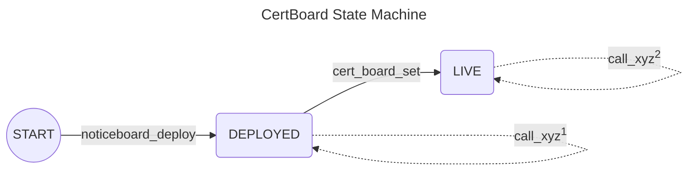

# State Machine of CertBoard

This file visualizes the state machine of the [CertBoard](/smart_contracts/cert_board/contract.py).

# Notes:

(\*)Any action that fails maintains the last state.

(\*\*)Call of any action fails if not called from the state where it is explicitly allowed.

(1)Possible actions are:

[//]: # "For platform manager"

- `cert_board_deploy`
- `cert_board_key_reg`
- `cert_board_optin_asa`
- `cert_board_set`
- `cert_board_withdraw`

(2)Possible actions are:

- all from (1)

[//]: # "For user"

- `stress_create`
- `stress_start`

[//]: # "For anyone"

- `cert_create`
- `cert_get`
- `stress_end`
- `stress_get`
- `stress_record`
- `stress_unused`

# List of actions

Below is a list of all possible actions to transition between states.
A description of each action is added.

- `cert_board_deploy`:  
  Requires as input: nothing.  
  Deploys the main smart contract of the certification platform.  
  The smart contract creator becomes the platform manager.  
  Sets the contract state to `DEPLOYED`.  
  Returns: the created app ID.

- `cert_board_key_reg`:  
  Requires as input: participation key information, and ALGO payment transaction.  
  Succeeds only if called by the platform manager.  
  Registers the input address (signed by the platform's address = e.g. also any rekeyed addresses) in network consensus with the given participation key information.  
  Checks if the payment transaction is to this contract.  
  The payment amount is used as the fee for issuing the key (de)registration transaction.
  _This allows covering consensus participation fee even upon suspension._  
  Returns: nothing.

- `cert_board_set`:  
  Requires as input: (new) platform manager, (new) platform's certificate fee, (new) expected network APY, (new) stress test fee amount and its ASA, (new) maximum duration, (new) maximum end round, and min and max stake amounts.  
  Succeeds only if called by the current platform manager or contract creator.  
  Sets (anew) information.  
  Performs sanity checks on the given parameters, e.g. max duration must be smaller than maximum end round; min stake amount is smaller than max stake amount; and CertBoard must be opted into the ASA.  
  Returns: nothing.

- `cert_board_optin_asa`:  
  Requires as input: ASA ID, an address (= to allow opting in any accounts that are rekeyed to the platform), and ALGO payment transaction.  
  Succeeds only if called by the platform manager.  
  Opts the platform address in to the ASA.  
  MUST be accompanied by a payment for the MBR increase.  
  Returns: nothing.

- `cert_board_withdraw`:  
  Requires as input: `asset` (i.e. ASA ID or 0 for ALGO) and `amount`.  
  Succeeds only if called by the platform manager.  
  Sends amount `amount` of the asset `asset `from the input to the platform manager account.  
  Fails if in case of ALGO, the remaining balance would fall below the platform's MBR + blocked amounts.  
  Returns: nothing.

The following actions are related to the management of a certificate.

- `cert_create`:  
  Requires as input: recipient address, certificate information, a payment transaction, and a general transaction.  
  Fails if not called from `LIVE` state.  
  Check if a box with name `recipient` address + "cert" + sender address already exists.  
  If not, create a new box with this name and fill it with the input information.  
  If it already exists, modify the box to fill in the input information.  
  Fails if the accompanied ALGO payment transaction does not cover the MBR increase for the box.  
  Fails if the accompanying general transaction is neither an ALGO payment nor ASA transfer transaction to the platform with amount matching the certificate issuance fee.  
  _For simplicity use just 1024 B as max certificate info._  
  Returns: nothing.

- `cert_get`:  
  Requires as input: certificate holder address and certificate issuer address.  
  Fails if not called from `LIVE` state.  
  Returns: Contents of box (certificate holder address + "cert" + certificate issuer address).

The following actions are related to the management of a stress test.

- `stress_create`:  
  Requires as input: requested stake, duration, maximum duration, ALGO payment transaction, a general transaction.  
  Fails if not called from `LIVE` state.
  Fails if requested stake is larger or smaller than the max and min platform amounts.

  ***

  Calls `create` on a stress testing contract.
  Provides as input: sender as the `user_address`, platform manager as the `owner_address`, input stake as `stake`, input duration as `duration`, input max duration as `duration_max`.
  Creates the stress testing smart contract.
  Receives: the created app ID.

  ***

  Calculate `fee` for the service as: `duration_max` \* `fee_round`.  
  Fails if the general transaction is neither an ALGO payment nor ASA transfer transaction to this contract.  
  Fails if the general transaction does not match the current accepted payment asset.  
  Fails if the sent amount does not equal the required fee payment (`fee`).  
  Fails if the accompanied ALGO payment transaction does not equal the test setup fee. _The test setup fee should cover the app creation, the fee for registering the test contract to go online, and potential loss of rewards._  
  Blocks the requested stake + fee for registering the contract to go online.
  Returns: created app ID.

- `stress_end`:  
  Requires as input: user address and stress testing ID.  
  Fails if not called from `LIVE` state.  
  Fails if a box name (user address + stress testing ID) does not exist on the platform with contents `IN_PROGRESS`.

  ***

  Forwards the call to the given app in the input.
  Provides as input: the sender's address.
  The stress test ends - either prematurely by platform manager or after its successful completion.
  ALGO is returned.
  Stress testing contract is deleted.
  Receives: `success`, average online stake, number of produced blocks, `round_start`, `round_end`, `stake`, `user_address`.

  ***

  Reduces the blocked ALGO amount for the received amount.  
  If returned `success` is True, puts in the box with name (user address + stress testing ID) the returned values.  
  Returns: nothing.

- `stress_get`:  
  Requires as input: certificate holder address, and stress test app ID.  
  Fails if not called from `LIVE` state.  
  Returns: Contents of box (certificate holder address + ID).

- `stress_record`:  
  Requires as input: user address and stress testing ID.  
  Fails if not called from `LIVE` state.  
  Fails if a box name (user address + stress testing ID) does not exist on the platform with contents `IN_PROGRESS`.

  ***

  Forwards the call to the given app in the input.
  Provides as input: nothing.
  Total online stake and last produced block are recorded.
  Receives: nothing.

  ***

  Returns: nothing.

- `stress_start`:  
  Requires as input: stress testing ID, participation keys info, and an ALGO payment transaction.  
  Fails if not called from `LIVE` state.  
  Fails if sender is not recorded as the user at the input stress testing app.

  ***

  Creates an ALGO payment transaction to the given app ID for the specified stake amount + fee for registering for rewards.
  Forwards the call to the app ID given in the input.
  Provides as input: sets sender address as the user address, participation keys, and the created ALGO payment transaction.  
  Stress testing contract starts participating in consensus.
  Receives: nothing.

  ***

  Creates a box for the sender + created app ID and sets its contents to `IN_PROGRESS`.  
  Fails if the accompanied ALGO payment transaction does not cover the MBR increase for the box.

  Returns: nothing.

- `stress_unused`:  
  Requires as input: user address and stress testing ID.  
  Fails if not called from `LIVE` state.
  Fails if a box name (user address + stress testing ID) does not exist on the platform with contents `IN_PROGRESS`.

  ***

  Forwards the call to the app ID given in the input.
  Provides as input: nothing.  
  Stress testing contract gets deleted if it was unused in the stated booked time frame.
  ALGO is returned.
  Receives: requested stake amount.

  ***

  Reduces the blocked ALGO amount for the amount that was requested.  
  Returns: nothing.
