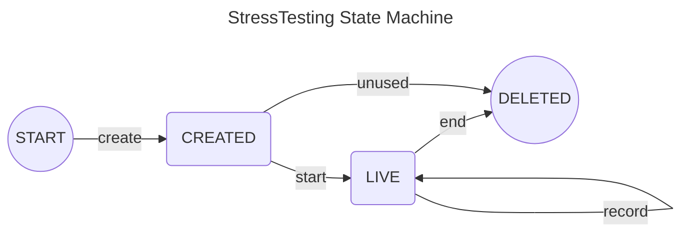

# State Machine of StressTesting

This file visualizes the state machine of the [StressTesting](/smart_contracts/stress_testing/contract.py).

# Notes:

(\*)Any action that fails maintains the last state.

(\*\*)Call of any action fails if not called from the state where it is explicitly allowed.

# List of actions

Below is a list of all possible actions to transition between states.
A description of each action is added.

- `create`:  
  Requires as input: `user_address`, `owner_address`, `stake`, `duration`, `duration_max`.  
  _Note: duration is effectively reduced for 320 due to consensus stake trailing._
  Creates the stress testing smart contract.  
  Stores input information.  
  Initializes `round_ended` to UINT64_MAX.  
  Initializes `cnt_produced_blocks` to zero.  
  Initializes `total_stake_sum` to the current online stake.  
  Initializes `cnt_total_stake_sum` to 1.  
  Changes the contract state to `CREATED`.  
  Sets `round_created` to `current round`.  
  Sets `round_end_max` to `current round` plus `duration_max`.
  Fails if `duration` is larger than `duration_max`.  
  Returns: the created app ID.

- `start`:  
  Requires as input: user address, participation keys to use and payment transaction.  
  Succeeds only if called by the contract creator.  
  Fails if not called from `CREATED` state.  
  Succeeds only if input user address matches `user_address`.  
  Sets `round_end` to `current round` plus `duration`.
  Fails if `round_end` is larger than `round_end_max`.  
  Fails if the payment transaction is not to this contract with the `stake` amount + fee for registering for rewards.  
  Sets `round_start` to `current round` plus 320.  
  Sets `last_block` to `round_start`.  
  Fails if participation keys are not between `round_created` and `round_end_max`.  
  Sends a key participation transaction with the input info.
  Changes the contract state to `LIVE`.  
  Returns: nothing.

- `end`:  
  Requires as input: address.  
  Succeeds only if called by the contract creator.  
  Fails if not called from `LIVE` state.
  Set `round_ended` to `current round`.  
  Check if called by `owner_address`. If so, and if `round_ended` smaller than `round_end`, set `success` to False, otherwise set `success` to True.  
  Fails if called by anyone else other than `owner_address` and `round_ended` is smaller than `round_end`.  
  Sets `success` to True.
  Closes the account to contract creator.  
  Calculates the average online stake during the stress test.
  Deletes the contract.  
  Returns: `success`, average online stake, number of produced blocks, `round_start`, `round_end`, `stake`, `user_address`.

- `record`:  
  Requires as input: nothing.  
  Fails if not called from `LIVE` state.  
  Fails if `current round` is larger than `round_ended`.  
  Fails if `round_end` is larger than the current last produced block of this contract. _This is to prevent recording results beyond the agreed duration._  
  If `last_block` is smaller than current last produced block of this contract, increment `cnt_produced_blocks` and update `last_block`, as well as add the current online stake to the `total_stake_sum` and increment `cnt_total_stake_sum` for 1; otherwise fail.  
  Returns: nothing.

- `unused`:  
  Requires as input: nothing.  
  Succeeds only if called by the contract creator.  
  Fails if not called from `CREATED` state.  
  Fails if `current round` plus `duration` is smaller than `round_end_max`.
  Closes account to calling contract.  
  Deletes the contract.  
  Returns: requested stake amount.
